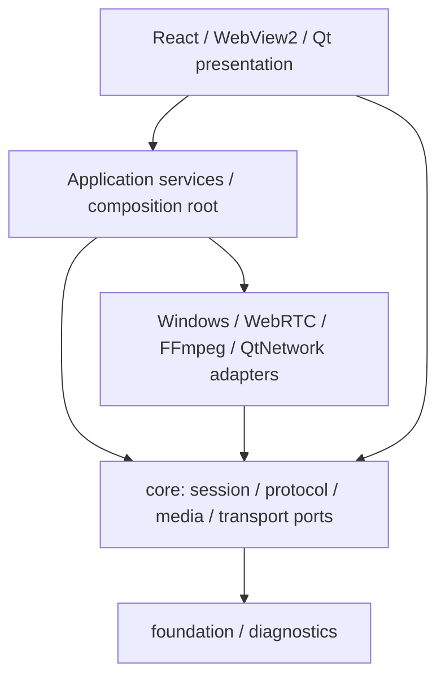

# 架构概览

## 总体原则

工程采用端口与适配器结构。`core` 定义业务类型、状态和抽象端口，具体的 Windows、WebRTC、FFmpeg、QtNetwork 与 WebView2 实现在适配器中，`KApplicationComposition` 是唯一组合根。

依赖箭头表示“使用”。核心层不知道 `PeerConnection`、DXGI、D3D、FFmpeg 或 WebView2 的具体类型。

## CMake 目标

最终交付仍是一个 `winRemoteControl.exe`。构建目录中的多个 `.lib` 是分层产生的静态库，不是需要单独分发的程序。

| 分组 | 主要目标 | 职责 |
| --- | --- | --- |
| 基础与核心 | `wrc_foundation`、`wrc_protocol`、`wrc_core`、`wrc_diagnostics` | 公共类型、协议 Codec、状态机、端口接口、结构化错误和诊断 |
| 应用服务 | `wrc_session_application`、`wrc_capture_application`、`wrc_discovery_application`、`wrc_recent_device_application`、`wrc_settings_application`、`wrc_clipboard_application` | 编排用例，不直接绑定具体平台实现 |
| 外部适配 | `wrc_webrtc_adapter`、`wrc_ffmpeg_adapter`、`wrc_signaling_adapter`、`wrc_udp_discovery_adapter`、`wrc_windows_capture_adapter`、`wrc_windows_adapters`、`wrc_settings_adapter` | WebRTC、编解码、TCP/UDP、DXGI、Win32 和 INI 持久化 |
| 展示 | `wrc_qt_presentation` | Qt 窗口、WebView bridge、原生视频控件和 UI DTO |
| 组合根 | `winRemoteControl` | 创建对象、注入端口实现、连接信号并管理进程退出 |

## 关键对象与所有权

- `KApplicationComposition` 创建并持有进程级服务和适配器，负责应用关闭的异步收尾。
- `KSessionCoordinator` 保留跨模块编排和主状态迁移；Peer 初始化/回滚、Access 传输与审批、能力交换、媒体采集、可靠 Session 命令、恢复与关闭分别委托给小型 Controller。
- `KAccessSessionFlow` 管理监听、主动连接、最近端点和 Access/SDP 信令的传输边界；`KPeerLifecycleController` 隔离 WebRTC generation、初始化回滚及异步关闭完成；`KCapabilitySessionFlow` 管理三秒能力交换与协商结果；`KMediaSessionController` 管理流配置约束和幂等 Capture 启停。
- `KSessionStateMachine` 只表达合法状态转换和权限判断，不执行外部 I/O。
- `KRemotePeerTransport` 是核心层面向远端 Peer 的端口；`KWebRtcPeer` 是其 WebRTC 实现。
- `KCaptureService` 管理采集线程、generation 和 FrameSink；DXGI 采集源不依赖 WebRTC。
- ViewModel 和 bridge 将 C++ 状态映射给 React，不创建或拥有网络、采集对象。
- `KTerminalSessionService` 与 `KTerminalCommandDispatcher` 管理终端审批、实例序号、可靠命令、流控和状态；控制端由 `KWindowsTerminalFrontend + wrcTerminalRelay.exe` 接入 Windows Terminal，被控端由 `KWindowsPseudoConsole` 托管 ConPTY/Job Object。

## 线程模型

- GUI 线程：窗口、WebView2、D3D 控件、轻量状态编排。
- Capture 线程：DXGI 抓帧与采集循环。
- WebRTC network/worker/signaling 线程：WebRTC 内部网络与媒体任务。
- teardown 后台任务：异步释放 PeerConnection、Factory 和 WebRTC 线程。
- latency trace 线程：批量落盘高频延迟事件。

跨线程回调携带 `generation`，并通过 Callback Gate 投递到目标 Qt 线程。停止或对象销毁后 Gate 会拒绝迟到回调。

## 依赖规则

1. `core` 不包含 Win32、WebRTC、FFmpeg、D3D、DXGI、Qt Widgets 或 WebView2 类型。
2. adapter 可以依赖核心端口与对应外部库，但不决定会话业务状态。
3. presentation 只提交用户意图和显示 C++ 状态，不复制安全或重连策略。
4. 新边界优先用小型类型化接口；没有真实替换点时不为每个类制造接口。
5. 高频数据必须使用有上限队列、合并或丢弃旧数据的策略，不能无限积压。

长期演进约束见[项目架构方针](../../PLAN.md)。
