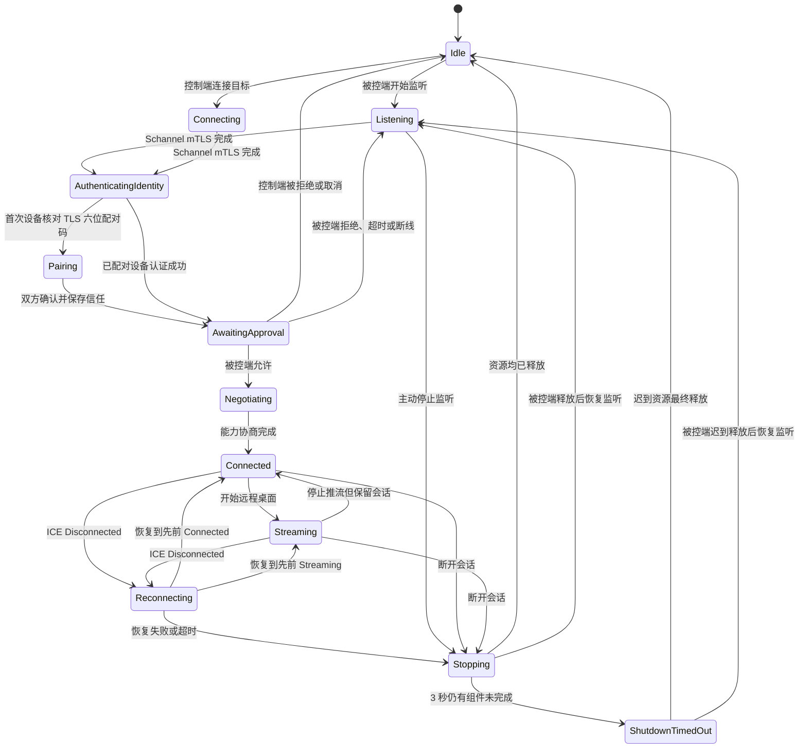
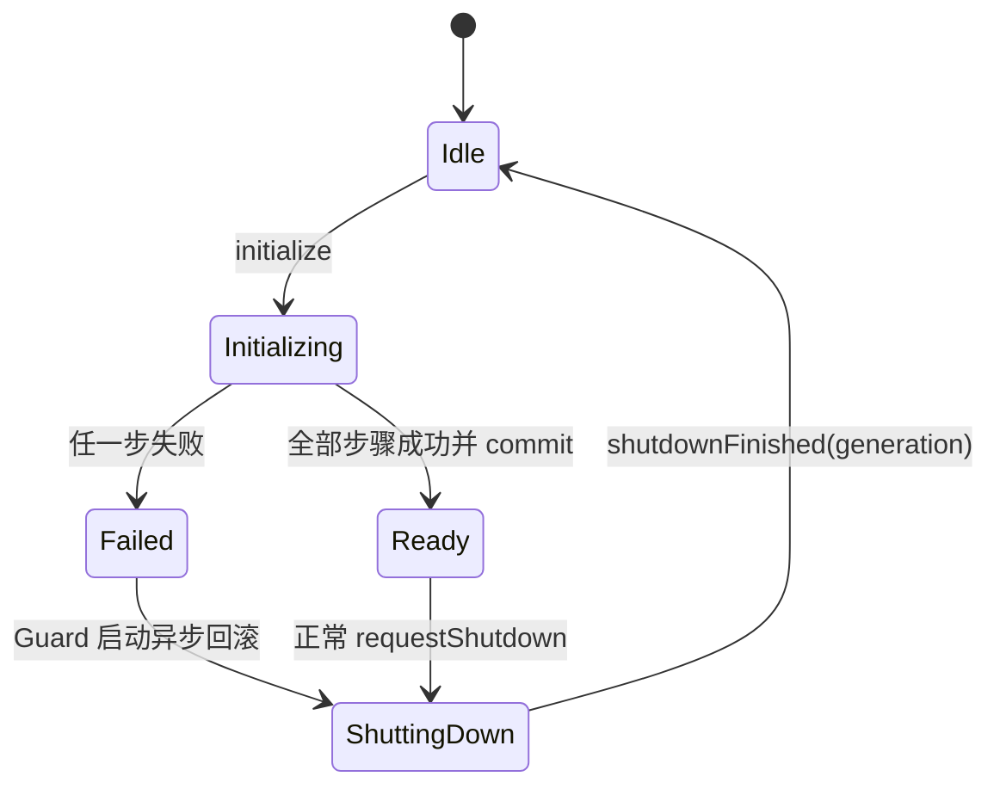

# 会话生命周期

`KSessionCoordinator` 与 `KSessionStateMachine` 共同管理业务状态。底层 socket、ICE 或 DataChannel 状态不能绕过业务状态直接开放画面和输入。

## 主状态流

## 接入审批与能力协商

1. TCP 固定版本前导后由 Schannel 完成 TLS 1.2/1.3 双向证书握手；未知设备使用 TLS Exporter 生成六位配对码，由两端进行 Numeric Comparison。完整 SHA-256 SPKI 只用于安全详情和后续证书固定。
2. 身份认证成功后才发送 `accessRequest`。`autoAccept` 只适用于未撤销且请求未超过权限上限的可信设备。
3. 被控端允许后控制端创建 SDP Offer；SDP/ICE 只通过已认证且加密的 TLS 通道传输。
4. Session DataChannel 打开后双方交换 `KSessionCapabilities`。
5. H.264、`video`、`session`、`input` 和协议版本必须存在交集；三秒内不能完成时明确报版本不兼容。
6. 协商成功才进入 `Connected`，剪贴板、实时输入和画质上限使用交集结果。

审批前不采集、不开放输入。完整重连会创建新的审批请求；只有同一条已审批会话内的 ICE Restart 不重复审批。

## 短暂断网恢复

首次 ICE `Disconnected` 后进入 `Reconnecting`，立即暂停输入并释放被控端已按下的键鼠。若 TCP 信令仍可用，只有原 Offer 发起方请求一次 ICE Restart；恢复窗口为 10 秒。成功后回到中断前的 `Connected` 或 `Streaming`，失败则进入一次性清理。

## 正常停止与异常停止

Capture 和 Peer 使用请求式异步停止。`Stopping` 会等待两者按当前 `generation` 完成，再进入 `Idle` 或恢复 `Listening`。重复停止、旧 generation 和迟到回调不会重复结束会话。

停止超过 3 秒进入 `ShutdownTimedOut`：连接入口被禁用，旧资源被隔离且不得复用。迟到完成仍会被接收，只有确认资源释放后才恢复可用状态。析构采用有限等待，不调用 `QThread::terminate()`。

## WebRTC 初始化失败回滚

`KWebRtcPeer` 的内部生命周期为：

初始化依次覆盖 WebRTC 线程、Factory、PeerConnection、四条 DataChannel、本地视频 Track 和远端视频 Receiver。任何步骤失败都返回带阶段的 `KPeerInitializationResult`，关闭 Callback Gate，清空队列，并复用 teardown 反向释放已创建资源。

失败请求本身不会自动重试。回滚期间用户的新请求只保留最后一个，匹配 generation 的异步完成到达后才执行。回滚同样有 3 秒 watchdog；超时进入 `ShutdownTimedOut`，避免半初始化资源参与新会话。
