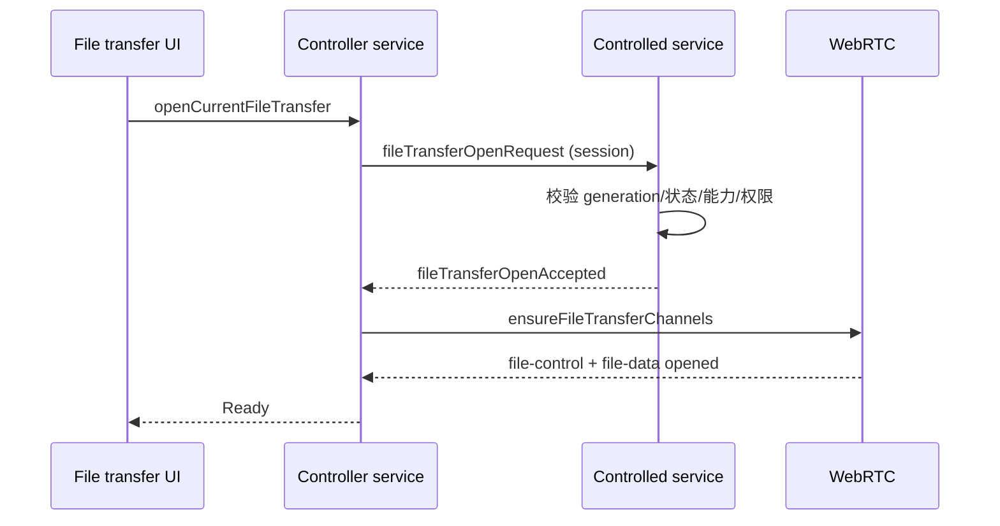

# 双向文件传输

## 目标与边界

文件传输是已认证远程会话中的可选能力。它允许控制端在独立双栏窗口中浏览本机与被控端目录，并双向复制普通文件。核心行为由 C++ 实现；React 只展示目录和任务快照，不读取文件正文，也不决定真实路径。

第一版设计边界：

- 支持上传、下载、空文件、多选和文件夹递归复制。
- 保留目录结构与最后修改时间。
- 不提供删除、移动、重命名、拖放和文件预览。
- 不复制 ACL、所有者、ADS、扩展属性或链接对象。
- 不跨完整重连或新 `generation` 续传。
- 单批文件夹展开最多 50,000 项，超出时返回明确错误。
- 自动测试只使用隔离临时目录；双机真实目录测试由人工完成后才能宣称通过。

## 权限与打开流程

文件传输使用独立的 `FileTransferPermissionScope`，稳定权限名为 `fileTransfer`。旧可信记录缺少该字段时视为未授权，但不会清除已有信任，也不会使原有 `autoAccept` 失效。

可用条件取以下交集：

```text
有效 fileTransfer 权限
∩ 双方声明 file-control
∩ 双方声明 file-data
∩ 当前 generation 仍处于 Connected/Streaming
```

打开流程为：



文件传输权限本身即代表允许浏览和复制，因此不显示第二次审批。被控端始终显示文件传输活动状态并可本地停止；本地停止后，本 generation 内不允许远端重新打开。两条通道建立失败只关闭文件功能，不结束远程桌面。

## 通道与流控

文件功能使用两条由控制端按需创建的 WebRTC DataChannel：

| Label | 模式 | 内容 |
| --- | --- | --- |
| `file-control` | reliable、ordered | 目录分页、任务、ACK、暂停、取消、冲突、完成和错误 |
| `file-data` | reliable、ordered | 文件二进制块，不包含路径 |

生命周期消息仍通过 `session` 通道发送。`file-control` 的控制消息由 `KFileTransferControlMessageCodec` 编码为类型化 JSON，单条不超过 128 KiB。`file-data` 使用 `KFileTransferDataFrameCodec`；固定大端头携带版本、flags、`taskId`、`fileId`、offset 和长度，正文按 32 KiB 分块，整帧不超过 64 KiB。

流控参数固定为：

- DataChannel 高水位 1 MiB、低水位 256 KiB。
- 应用层未确认数据最多 1 MiB。
- 接收端每实际落盘累计 256 KiB或文件结束时发送累计 ACK。
- 全局一次只传输一个文件，其余任务顺序排队。
- UI 进度最多每 100 ms 发布一次，避免每块数据触发 React 更新。

这些限制让大文件传输不会建立无上限队列，也尽量避免明显挤占画面和输入的处理时间。

## 目录与路径安全

两端目录都由对应端 `IKFileSystemPort` 枚举。每次列表生成当前 generation 内有效的 `listingId`，每个条目有随机、不透明的 `entryId`。React 复制文件时只能提交来源 `listingId + entryId` 与目标目录 token，不能提交最终路径或文件名。

地址栏可以提交绝对盘符路径，但必须由本机 C++ 规范化。第一版拒绝：

- UNC 路径。
- Win32/NT 设备路径与 `GLOBALROOT`。
- ADS、保留设备名、NUL 和目录逃逸。
- 过期 listing、未知 entry 或跨 generation token。
- 对 reparse point、junction 或 symlink 的递归传输。

映射网络驱动器和直接 UNC 路径在第一版中均不开放。原因是盘符可以在一次传输期间被重新映射；在引入稳定的后端目录句柄或等价的防竞态机制前，拒绝这类路径比依赖可变盘符更安全。所有已支持的本地文件操作使用运行应用的当前用户权限，不提权，也不触发 UAC。

## 完整性与原子提交

发送端打开源文件时保存大小和最后修改时间快照，并增量计算 SHA-256。传输期间如果源文件大小、标识或修改时间发生变化，任务以 `source_changed` 失败，避免把不同时刻的内容拼成一个文件。

接收端不直接覆盖目标文件，而是在同一目标目录中独占创建 `.wrc-part-<uuid>`：

1. 严格要求 offset 连续，拒绝重复、跳跃或跨任务数据。
2. 写入时增量计算 SHA-256。
3. 文件结束后比较期望大小与 SHA-256。
4. 校验通过才在同卷执行原子重命名或替换。
5. 失败或取消时关闭句柄并删除临时文件。

覆盖已有文件时，旧文件保留到新临时文件完全校验成功。任务只删除自己新建且仍为空的目录，不删除已有目录。

## 冲突与任务生命周期

目标已存在时任务暂停，由用户选择：

- `overwrite`：校验新文件成功后替换旧文件。
- `keepBoth`：由目标端 C++ 生成不冲突的名称。
- `skip`：跳过当前项。

选择可以应用到当前批次后续冲突。文件读写、目录枚举、哈希和清理由工作线程执行；回调带 `generation + taskId` 并投递回 Qt 所属线程后，才允许访问 transport 或发布 UI 状态。

短暂网络中断进入 `Reconnecting` 后，不再读取或发送新数据；同一会话恢复时从最后累计 ACK 的 offset 继续。DataChannel 关闭、主会话结束、权限撤销或 generation 改变会取消所有任务、关闭句柄并异步清理临时文件。第一版不持久化任务历史，也不进行跨会话断点续传。

## 诊断与验证状态

文件传输日志只记录 generation、taskId、阶段、字节数和错误码，不记录路径、文件名、正文或哈希。线上正文由 WebRTC SCTP over DTLS 加密，身份与 Peer 协商仍依赖 Schannel 认证后的信令链路。

代码级验证应覆盖 Codec、路径拒绝、临时文件提交、SHA-256、背压、累计 ACK、冲突、取消和生命周期。完成构建与自动测试并不等于双机真实目录已经验证；正式标记可用前仍需人工完成双机上传、下载、大文件、冲突和断网恢复测试。
