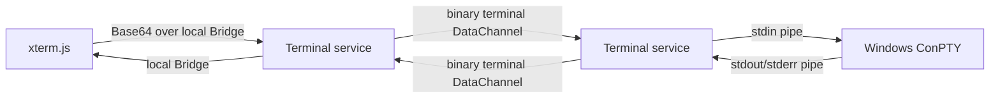

# 远程 PowerShell 终端

远程终端是已审批 WebRTC 会话的可选附加能力。它不会绕过主连接审批，且每个新会话首次打开终端时还需要被控端单独确认。

## 组件

- `KTerminalSessionService`：管理权限、状态、generation、单实例和输出背压。
- `KWindowsPseudoConsole`：动态检测 ConPTY API，以当前用户权限启动 `powershell.exe -NoLogo`。
- `KRemoteTerminalWindow`：承载专用 WebView2 页面，不与桌面视频窗口绑定。
- xterm.js：处理 VT 转义序列、键盘输入和窗口尺寸。

## 权限和状态

内部状态为 `Closed -> AwaitingApproval -> Opening -> Running -> Closing/Failed`。同一 generation 中一次允许后可关闭并重新打开，不重复弹出；拒绝或超时后本会话不再询问。完整重连会产生新 generation，因此必须重新审批。

`Reconnecting` 期间 PowerShell 进程保留，但终端输入和输出发送暂停。恢复失败、终端 DataChannel 关闭或主会话结束时，Job Object 终止 PowerShell 及子进程。

## 边界

- 固定使用 Windows PowerShell 5，不选择 Shell，不保存历史。
- 继承应用当前用户和权限，不触发 UAC，不提权。
- 单次数据不超过 64 KiB；输入队列上限 256 KiB，输出队列上限 1 MiB。
- 不支持终端作为文件传输、后台持久化或隐藏运行入口。
- ConPTY 需要 Windows 10 1809 或更高版本；API 不可用时不声明 `terminal` 能力。
