# 视频链路

## 总览

```mermaid
flowchart LR
    DXGI["DXGI Desktop Duplication"] --> BGRA["KCaptureFrame / BGRA"]
    BGRA --> LOOP["CaptureLoop / KCaptureService"]
    LOOP --> SINK["KCaptureFrameSink"]
    SINK --> I420["FFmpeg swscale / I420"]
    I420 --> SOURCE["WebRTC VideoSource"]
    SOURCE --> ENC["H.264 encoder"]
    ENC --> RTC["WebRTC video track"]
    RTC --> DEC["H.264 decoder"]
    DEC --> PROCESS["RemoteFrameProcessor / I420 to BGRA"]
    PROCESS --> D3D["KVideoRenderWidget / D3D11"]
```

## 被控端

`KDxgiDesktopDuplicator` 从当前默认输出采集桌面和指针，生成与 WebRTC 无关的 BGRA `KCaptureFrame`。CaptureLoop 负责帧率、超时和取消；`KCaptureService` 管理线程、generation、Sink 选择和停止。

WebRTC FrameSink 使用 FFmpeg `swscale` 按协商流配置缩放并转换为 I420。I420 帧通过核心媒体类型交给 WebRTC VideoSource，因此 DXGI adapter 不需要包含 WebRTC/libyuv 头文件。

静态桌面启动时，首帧后的短保护期可重推最近帧并刷新时间戳，避免软件编码器尚未输出时长期黑屏。保护期结束后仍以桌面变化驱动为主，不持续发送重复帧。

## H.264 编码

编码器优先尝试 Windows Media Foundation 的 `h264_mf`。初始化失败会完整释放失败上下文并自动回退到 `libx264`；软件路径使用 `ultrafast`、`zerolatency`、低延迟、无 B 帧和受控 GOP。

WebRTC 输入为 I420，编码器内部转换为 NV12。线上保持 H.264 和既有 SDP/Annex-B 处理，控制端不需要知道硬件或软件编码器的选择。

## 控制端

WebRTC H.264 decoder 输出 I420。`KWebRtcRemoteFrameProcessor` 在专用转换线程中将其转换为 Windows D3D 渲染所需的 BGRA，并采用“待处理帧只保留最新一张”的有界槽位：新帧覆盖尚未开始转换的旧帧，GUI 线程不会执行 I420 到 BGRA 的大块转换。转换结果使用共享像素存储跨 Qt 队列传递，避免每帧再次深拷贝约 `width * height * 4` 字节。该策略减少排队延迟，而不是传输错误；会话结束日志会输出 received、processed 和 coalesced 汇总。

`KVideoRenderWidget` 在 GUI/渲染边界显示最新帧，并将画面坐标映射为远端输入坐标。视频帧携带最近输入序号，用于控制端以单调时钟计算输入发送到画面完成渲染的 round trip。

## 延迟策略与可观测性

- 播放延迟默认使用低延迟配置，不依赖两台机器系统时间计算端到端耗时。
- 高频回调合并旧帧，避免“完整播放过时画面”累积延迟。
- 采集、编码无输出、首帧重推、解码、转换入队和真正呈现均有诊断事件；`render_end` 可拆分 callback-to-convert、convert-to-enqueue、enqueue-to-present 和 callback-to-present。
- 画质配置受能力协商的最大分辨率、FPS 和码率约束。

当前固定采集默认显示器。能力消息包含 monitor list 仅为后续扩展，本阶段没有多显示器切换入口。
