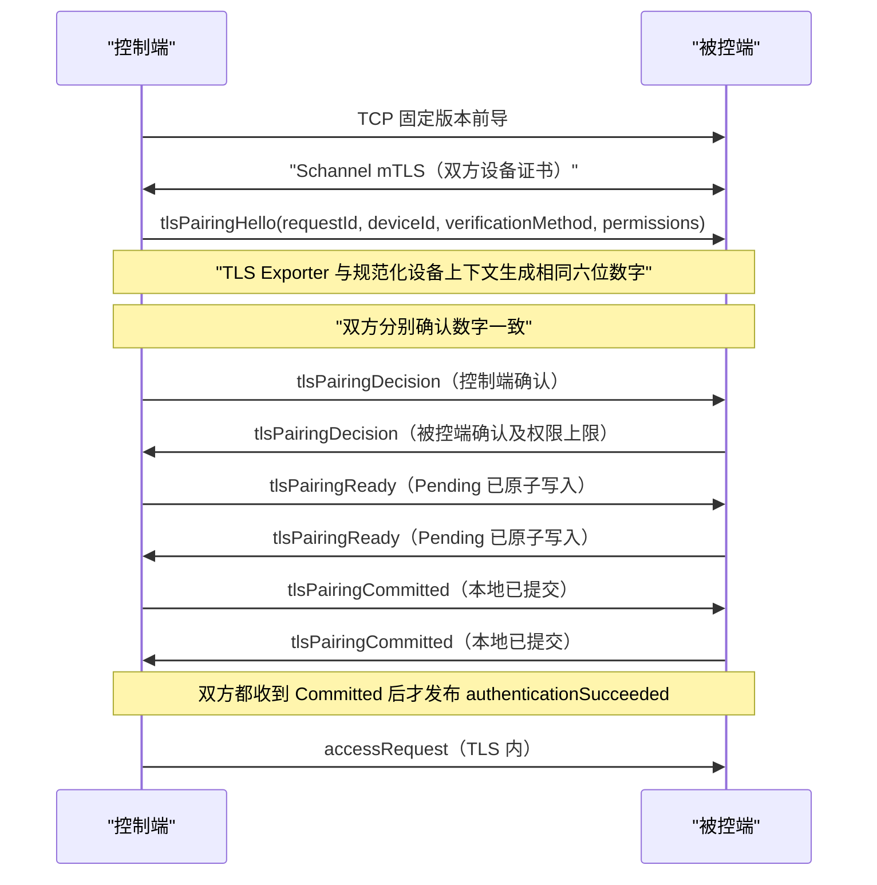

# 设备身份、mTLS 配对与权限

每个 Windows 用户拥有一份持久设备身份。ECDSA P-256 私钥由 Windows CNG 用户密钥库持有且不可导出；同一密钥对应的自签名设备证书保存在当前用户证书库。`security/device_identity.json` 只保存公开身份描述，`security/trusted_devices.json` 保存已固定的远端 SPKI 指纹与权限上限。两个 JSON 文件均由本机设备私钥签名并原子写入。

## 安全信令通道

现有 `QTcpSocket` 只负责字节收发，`KSchannelTlsEngine` 使用 Windows Schannel 在其上完成 TLS 1.2/1.3 双向证书认证和记录加解密。TLS 1.0/1.1 被禁用，握手后还会检查 ECDHE/AEAD 密码套件。除固定 8 字节版本前导及 `OK/BUSY/INCOMPATIBLE` 外，Access、SDP 和 ICE 都只在 TLS 内传输。

设备证书必须满足：当前有效、自签名可验证、ECDSA P-256、Digital Signature Key Usage、Client/Server Authentication EKU，以及包含合法设备 UUID 的 SAN URI。两端都必须在握手中实际使用对应私钥。

## 首次配对

未知设备的 `tlsPairingHello` 必须声明 `verificationMethod=tls-exporter-numeric-v1`。两端使用 Schannel 的 TLS Keying Material Exporter，标签固定为 `EXPERIMENTAL-winRemoteControl-pairing-v1`；上下文按固定角色顺序包含协议版本、Access `requestId`、双方设备 UUID 和 SPKI SHA-256。导出结果的前 32 位映射为保留前导零的六位数字，例如 `482 731`。导出材料和数字均不通过协议发送，也不写入日志或存储。

两端均确认数字一致后进入独立的 `KPairingTransaction`。可信记录先以 `Pending` 状态和本次 `requestId` 原子写入；双方交换 `Ready` 后再提交为 `Mutual` 并交换 `Committed`。只有双方都收到同一事务的 `Committed`，才发布认证成功。拒绝、超时、断线、TLS Exporter 不可用或任一端写入失败会回滚本次事务；更新已有记录时恢复完整旧记录。程序启动时会清理崩溃遗留的 `Pending`，而 `Mutual` 记录只有在下一次握手中双方声明相同提交 ID 才可自动认证，因此单端提交不能独自形成有效信任。

完整指纹格式仍为 `SHA256:<Base64(SHA256(SPKI DER))>`，但仅放在折叠安全详情中。后续连接比较设备 UUID、固定 SPKI 与双方提交 ID；同一 UUID 更换公钥时以 `device_key_changed` 拒绝，必须撤销后重新配对。

`tlsPairing*` 只负责交换验证方法、首次用户确认、权限选择和双方提交结果，不携带配对数字、TLS 导出材料、公钥、nonce、自定义 proof、配对秘密或签名。设备持有证明、加密、完整性、顺序及防重放全部由 Schannel TLS 提供。系统不支持 TLS Exporter 时明确返回 `channel_binding_unavailable`，不会降级为人工比较指纹。

## 信任库迁移

可信设备库格式为 v3，额外记录 `commitState` 与 `pairingTransactionId`。v1/v2 信任不能证明双方完成新提交协议：首次读取时原文件分别备份为 `.v1.bak`/`.v2.bak`，随后创建空 v3 信任库并要求重新配对。私钥和证书私钥从不写入该文件。

正式文件始终通过同目录临时文件和 `QSaveFile`/`ReplaceFileW` 原子替换；禁止直接截断旧文件。临时写入或替换失败时保留上一份有效、已签名的信任库。

## 资源限制与错误边界

未认证连接的固定前导、TLS 握手密文、已加密信令和 socket 发送队列都有独立硬上限。监听 backlog、待处理连接和来源失败表也有固定容量；恶意握手失败进入十分钟滑动窗口，本机证书库或文件系统错误不会误封远端来源。

安全失败由 `KSecurityStatus` 表达，包含稳定的 domain、code、stage、是否可重试、是否需要重新配对及内部技术信息。协议只发送有限拒绝原因；Win32/Schannel 细节只写本地诊断日志。

## 权限

最终权限是请求范围、可信设备权限上限、本次确认和能力协商的交集。C++ 在真实入口检查 `ViewScreen`、`InputControl`、`Clipboard` 和 `Terminal`；React 的按钮状态只用于展示，不能授予权限。终端即使具有设备级权限，每次打开仍需独立审批。
