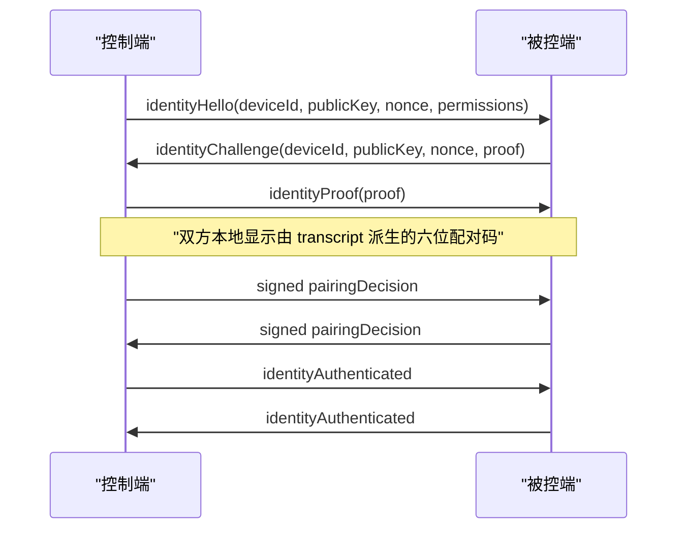

# 设备身份、配对与权限

每个 Windows 用户拥有一份持久设备身份。私钥由 Windows CNG 用户密钥库保存，算法为 ECDSA P-256，创建时禁止导出；`security/device_identity.json` 只保存公开身份描述。可信设备记录位于 `security/trusted_devices.json`，两个文件均由设备私钥签名并通过临时文件替换写入。签名不匹配时认证能力关闭，不会静默重建信任关系。

## 首次配对

配对码不会通过网络发送，也不会进入日志。两端均确认后才写入可信设备库；拒绝、超时或断线不会留下半成品记录。同一 `deviceId` 出现不同公钥时按密钥变化拒绝，必须先在设置页移除旧信任再重新配对。

## 后续认证与信令

已配对设备仍为每次 TCP 连接生成新 nonce 和新 transcript，并证明持有私钥。WebRTC Offer、Answer 和 ICE 不再以裸消息进入 Peer：认证信封绑定 Access `requestId`、双方设备 ID、transcript hash、本地 generation、权限、严格递增 sequence 以及原始信令 SHA-256。验签、方向或序号检查失败会结束本次协商。

认证保护完整性和设备身份，但当前 TCP 元数据没有加密；旁路观察者仍可能看到设备 ID、SDP 和 ICE 元数据。媒体和 DataChannel 继续由 WebRTC DTLS-SRTP/SCTP over DTLS 保护。

## 权限

最终权限由请求范围、可信设备权限上限、本次配对选择和能力协商共同收窄。C++ 在真实入口检查 `ViewScreen`、`InputControl`、`Clipboard` 和 `Terminal`；React 的按钮状态仅用于展示，不能授予权限。终端即使已被可信权限允许，每次打开仍需独立审批。
